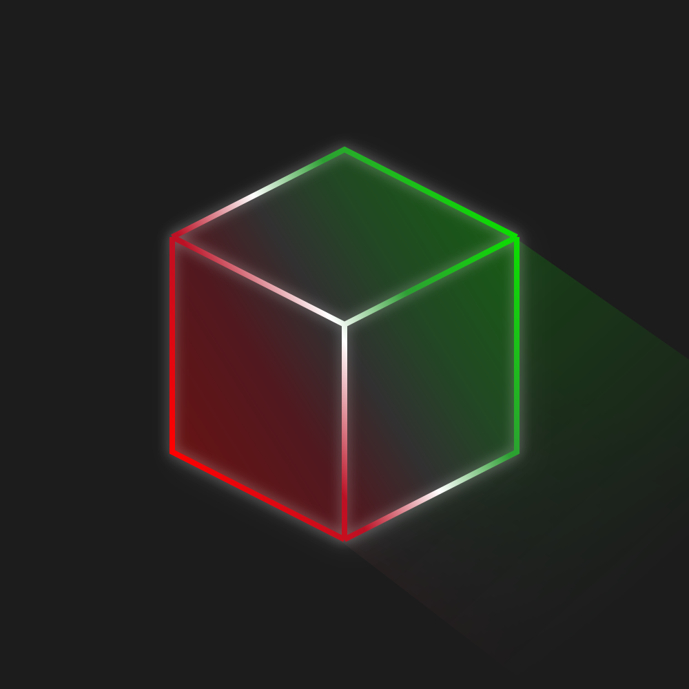

<!-- Improved compatibility of back to top link: See: https://github.com/Revvilon/PingOffsetMiner/pull/73 -->

<!--
*** Thanks for checking out the Best-README-Template. If you have a suggestion
*** that would make this better, please fork the repo and create a pull request
*** or simply open an issue with the tag "enhancement".
*** Don't forget to give the project a star!
*** Thanks again! Now go create something AMAZING! :D
-->

<!-- PROJECT SHIELDS -->
<!--
*** I'm using markdown "reference style" links for readability.
*** Reference links are enclosed in brackets [ ] instead of parentheses ( ).
*** See the bottom of this document for the declaration of the reference variables
*** for contributors-url, forks-url, etc. This is an optional, concise syntax you may use.
*** https://www.markdownguide.org/basic-syntax/#reference-style-links
-->

<!-- PROJECT LOGO -->
 

  

<h3 align="center">Ping Offset Miner</h3>

  

    The ping gliding mod
     

[![Discord-shield]][Discord-url] [![Modrinth-shield]][Modrinth-url] [![Github-shield]][Github-url]

  

<!-- TABLE OF CONTENTS -->

  
Table of Contents

  <ol>
    <li>
      <a href="#about-pom">About POM</a>
    </li>
    <li>
      <a href="#getting-started-with-pom">Getting Started with POM</a>
      <ul>
        <li><a href="#dependencies">Dependencies</a></li>
        <li><a href="#installation">Installation</a></li>
      </ul>
    </li>
    <li><a href="#usage">Usage</a></li>
    <li><a href="#contact">Contact</a></li>
    <li><a href="#acknowledgments">Acknowledgments</a></li>
  </ol>

<!-- ABOUT THE PROJECT -->
## About POM

Mining with high or unstable ping in Hypixel Skyblock can decrease efficiency by a severe amount. Though, with proper skill and knowledge, it is still possible to mitigate this with ping gliding.

The problem is ping gliding can be inconsistent, even for the most skilled miners out there. With POM, you don't have to guess.

By measuring user's ping, tps and Mining Speed to estimate when a block is registered as broken on the server, POM provides visual / auditory feedback to the user when it is safe to start mining another block.

This means that the user is able to greatly increase their efficiency by knowing exactly when to ping glide, not having to rely on muscle memory or pure luck.

(<a href="#readme-top">back to top</a>)

<!-- GETTING STARTED -->

## Getting started with POM

  
Frequently Asked Questions

### Is POM safe?
- Yes. POM does not break any TOS of the Hypixel Network. POM does not automate any task for the user, it only provides information that the user can then react upon. This mod is not and wil never be unsafe to use.

- Furthermore, the project will always remain open-sourced, meaning anyone is able to freely look through the code at any time.

### Lorem ipsum
- Dolor sit amet

### Lorem ipsum
- Dolor sit amet

### Dependencies

These mods are required for POM to function correctly, be sure to download them alongside POM
* [YACL (Yet Another Config Library)](https://modrinth.com/mod/yacl) : Configuration
* [ModMenu](https://modrinth.com/mod/modmenu) : Mod Screen

### Installation

> *It is recommended to use the [Modrinth App](https://modrinth.com/app)*

To download POM itself, head to the [Modrinth page](https://modrinth.com/mod/ping-offset-miner/versions) and download the latest mod version compatible with your minecraft version

(<a href="#readme-top">back to top</a>)

<!-- USAGE EXAMPLES -->
## Usage

Using Pom is very simple. The mod makes a default Configuration for the user with pre-defined settings, letting users to plug-and-play.

POM will add a highlighting box over the block the user is looking at. When mining, the overlay changes color to indicate that the block is broken, and the user can safely start mining another block.

_[Video example](https://studio.youtube.com/video/vtLrljxI1W0/edit)_

(<a href="#readme-top">back to top</a>)

<!-- CONTACT -->
## Contact

To talk to me, join the [Mining Cult Discord][Discord-url] and chat in the [POM discussion channel](https://discord.com/channels/963602635720622090/1472500074364801084)

(<a href="#readme-top">back to top</a>)

<!-- ACKNOWLEDGMENTS -->
## Acknowledgments

Developing this mod was not easy. I have never before programmed in Java and thus required tons of help to reach this state with my mod.

*  **[Odin Mod](https://github.com/odtheking/Odin): showed me how to read networking statistics**
*  **[NoFrills](https://github.com/WhatYouThing/NoFrills): Amazing Skyblock mod, a lot of inspiration taken**
*  **[Orbit Event System](https://github.com/MeteorDevelopment/orbit): A blazingly fast Event Handler used all throughout the mod**
*  **Momen: Designed the mod logo**

(<a href="#readme-top">back to top</a>)

[Modrinth-shield]: https://img.shields.io/modrinth/dt/nBWRHqI9?style=plastic&logo=modrinth&logoSize=auto&color=%2300AF5C
[Modrinth-url]: https://modrinth.com/mod/ping-offset-miner
[Discord-shield]: https://img.shields.io/badge/Discord-Discord?style=plastic&logo=discord&logoSize=auto&label=%20&labelColor=gray&color=%235865F2
[Discord-url]: https://www.discord.gg/mining
[Github-url]: https://github.com/Revvilon/PingOffsetMiner
[Github-shield]: https://img.shields.io/badge/Github-git?style=plastic&logo=github&logoSize=auto&label=%20&labelColor=gray&color=%23181717
